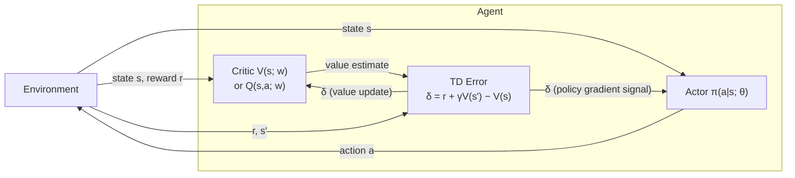

# Reinforcement Learning

**Definition** (Markov Decision Process).
$(\mathbf S, \mathbf A, T, R)$

## Value Function

**Definition** (Value Function).
$$
V \coloneqq \mathbb E \left[ \sum_{t=0}^\infty \gamma^t R_t \Bigg| S_0=s\right]
$$

**Theorem**.
*The value function lacks valence.*

*Proof sketch*.
You can add an arbitrary value $V_0$ to the value function and the value maximizing policy will not change.
Therefore, the identity element is not unique, which violates the assumption of valence.

## Temporal Difference

**Definition** (Temporal Difference).
$$
V(S_t)
\coloneqq
(1-\alpha)V(S_t)
+ 
\alpha \mathit{TD}(S_t)
\\
\mathit{TD}(S_t) \coloneqq R_{t+1} + \gamma V(S_{t+1})
$$
$\mathit{TD}$ is the temporal difference target.

**Theorem**.
*Temporal difference has valence*

Let the actor be a network with weights $\boldsymbol w$
and the critic a network with weights $\boldsymbol \theta$.

$$
\begin{align*}
\mathit{TD} &\coloneqq R_t + \gamma V^{\boldsymbol w}(S_{t+1}) - V^{\boldsymbol w}(S_t)
\\
\boldsymbol z^{\boldsymbol w} &\coloneqq \lambda^{\boldsymbol w} \boldsymbol z^{\boldsymbol w} + \nabla V^{\boldsymbol w}(S_t)
\\
\boldsymbol z^{\boldsymbol \theta} &\coloneqq \lambda^{\boldsymbol \theta} \boldsymbol z^{\boldsymbol \theta} + \nabla \ln \pi^{\boldsymbol \theta}(A_t\mid S_t)
\\
\boldsymbol w &\coloneqq \boldsymbol w + \alpha^{\boldsymbol w} \mathit{TD} \boldsymbol z^{\boldsymbol w}
\\ 
\end{align*}
$$

