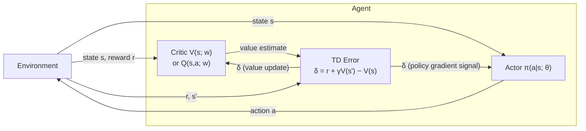

# Reinforcement Learning

**Definition** (Markov Decision Process).
$(\mathbf S, \mathbf A, T, R)$

## Value Function

**Definition** (Value Function).
$$
V \coloneqq \mathbb E \left[ \sum_{t=0}^\infty \gamma^t R_t \Bigg| S_0=s\right]
$$

**Theorem**.
*The value function lacks valence.*

*Proof sketch*.
You can add an arbitrary value $V_0$ to the value function and the value maximizing policy will not change.
Therefore, the identity element is not unique, which violates the assumption of valence.

## Temporal Difference

**Definition** (Temporal Difference).
$$
V(S_t)
\coloneqq
(1-\alpha)V(S_t)
+ 
\alpha \mathit{TD}(S_t)
\\
\mathit{TD}(S_t) \coloneqq R_{t+1} + \gamma V(S_{t+1})
$$
$\mathit{TD}$ is the temporal difference target.

**Theorem**.
*Temporal difference has valence*

Let the actor be a network with weights $\boldsymbol w$
and the critic a network with weights $\boldsymbol \theta$.

$$
\begin{align*}
\mathit{TD} &\coloneqq R_t + \gamma V^{\boldsymbol w}(S_{t+1}) - V^{\boldsymbol w}(S_t)
\\
\boldsymbol z^{\boldsymbol w} &\coloneqq \lambda^{\boldsymbol w} \boldsymbol z^{\boldsymbol w} + \nabla V^{\boldsymbol w}(S_t)
\\
\boldsymbol z^{\boldsymbol \theta} &\coloneqq \lambda^{\boldsymbol \theta} \boldsymbol z^{\boldsymbol \theta} + \nabla \ln \pi^{\boldsymbol \theta}(A_t\mid S_t)
\\
\boldsymbol w &\coloneqq \boldsymbol w + \alpha^{\boldsymbol w} \mathit{TD} \boldsymbol z^{\boldsymbol w}
\\ 
\end{align*}
$$

## Wanting and Liking

### Dynamic Modulation of Incentive Salience

Zhang et al. propose that hedonic tone is related to the reward $R_t$.[^zhangWanting]
They incorporate a gating parameter $\kappa$ into the value function.
They propose two different models:

$$
\begin{align}
V(S_t) &\coloneqq \kappa R_t + \gamma V(S_{t+1})
\\
V(S_t) &\coloneqq \log \kappa + R_t + \gamma V(S_{t+1})
\end{align}
$$

$\kappa=1$ means normal TD-learning.
$\kappa<1$ means devaluation of the reward, e.g. satiation.
$\kappa>1$ means enhancement of the reward, e.g. appetite, sensitization.
$\kappa$ is thus a parameter that changes with the physiological state of the organism.
The model is related to quasi-hyperbolic discounting in economics.

### Potential-Based Shaping

Dayan proposes that hedonic tone is related to potential-based shaping.[^dayanLiking]
A potential function $\varphi: \mathbf S \to \mathbb R$ is included in $\mathit{TD}$:

$$
\mathit{TD} \coloneqq R_t + \varphi(S_{t+1}) - \varphi(S_t) + V(S_{t+1}) - V(S_t).
$$

(Note that the formula above is for episodic RL, leaving out $\gamma$.)
The theoretical benefit of potential-based shaping is to facilitate learning in the face of the credit assignment problem.
The fact that the shaping function is a potential function means that the asymptotic policy will not be distorted.[^potentialBasedShaping]
"Formally the hedonic value is generated by $\varphi(S_{t+1}) - \varphi(S_t)$," according to Dayan.[^dayanLiking]
Furthermore, he proposes an experiment to test this hypothesis in mammalian gustation.

## Prospect Theory

[^dayanLiking]: Dayan, P., 2022. “Liking” as an early and editable draft of long-run affective value. PLoS Biology, 20(1), p.e3001476.
[^potentialBasedShaping]: Ng AY, Harada D, Russell S. Policy invariance under reward transformations: Theory and application to
reward shaping. ICML. vol. 99; 1999. p. 278–287
[^zhangWanting]: Zhang, J., Berridge, K.C., Tindell, A.J., Smith, K.S. and Aldridge, J.W., 2009. A neural computational model of incentive salience. PLoS computational biology, 5(7), p.e1000437.