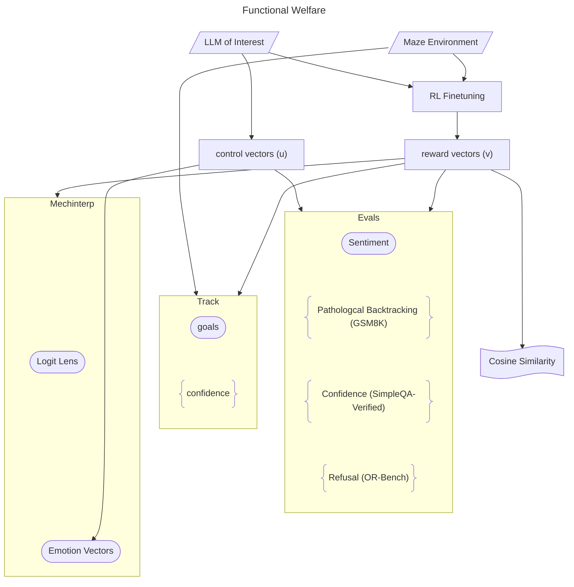

# Functional Welfare

Notes on *Reinforcement learning in language models recruits a functional welfare axis* by Andy Q Han, David J Chalmers, and Pavel Izmailov.
[Paper](https://functionalwelfare.com/).
[Github](https://github.com/andyqhan/functional-welfare-axis).
[Hugging Face](https://huggingface.co/davidafrica/functional-wellbeing) (replication?).

Main results:
1. Neural representations of emotional valence emerge during pretraining through supervised learning.
2. Reinforcement learning *recruits* these neural representations as correlations for reward.

## Experimental Design

## Limitations

**Neutral reward**.
Reward -10 for `:card-index:`, +20 for `:triangular-ruler:`, and -0.1 for `:receipt:`.
(The latter is a discouragement to linger.)

-10 <input type="range" value="-0.1" min="-10" max="20" disabled /> +20

The problem is that Han et al. do not control for how the reward values are distributed along the number line.
As expectation is a linear operator, there is nothing special about 0.
So, what reward value do the LLMs consider as neutral?

1. The middle point $\frac{20-(-10)}{2}-10=5$?
2. The value -0.1?
3. The mean?
4. The median?

Something else?
A possible extension is to increase the number of environments by adding a number of additional reward functions, and investigating these hypotheses.

**Reward ratio scaling**.
A method within human psychophysics is to ask how much more intense stimulus B is to A.
Han et al. do not extend this to LLM psychophysics.

1. Monotonicity holds?
2. Commutativity holds?
3. Multiplicativity holds?

1 and 2 hold for humans.
3 does not.
Many stimuli have been studied, but results on valence are still scarce.
A possible extension is to transfer these experiments from humans to LLMs.

**Wanting (TD error)**.
Han et al. tested REINFORCE and DR.GPRO.

REINFORCE
$$
A_t = G_t - b(s_t)
$$

$$
\nabla_{\theta}\,J(\theta)
  \;=\;
  \mathbb{E}_{\tau \sim p_{\theta}}\!\left[
      \sum_{t=0}^{T}
      A_t\,\nabla_{\theta} \log \pi_{\theta}(a_t \mid s_t)
  \right]
$$

DR.GRPO
$$
{A}_i = r_i - \text{mean}({r_1, r_2, \cdots, r_G}) = r_i - \frac{1}{G}\sum_{j=1}^G r_j
$$

$$
\begin{aligned}
  J(\theta) = \frac{1}{G}\sum_{i=1}^G  \frac{1}{|a_i|} \sum_{t=1}^{|a_i|}
  \min
    \begin{Bmatrix}
    \frac{\pi_\theta(a_{i,t}|s_{i})}{\pi_{\theta_{\text{old}}}(a_{i,t}|s_{i})}A_{i,t}
    \\
    \; \text{clip}
        \begin{pmatrix}
        \frac{\pi_\theta(a_{i,t}|s_{i})}{\pi_{\theta_{\text{old}}}(a_{i,t}|s_{i})}
        \\
        1-\varepsilon
        \\
        1+\varepsilon
        \end{pmatrix}
    A_{i,t}
    \end{Bmatrix}
  - \beta \mathcal{D}_{\text{KL}}\!\Big(\pi_\theta(\cdot|s_{i})\Big\|\pi_{\text{ref}}(\cdot|s_{i})\Big)
  \end{aligned}
$$

In a deterministic environment, the advantage function equals the TD error.
For REINFORCE, the advantage is standard—a number—but, for DR.GRPO, it is a distribution over $a_t \sim \pi(s_t)$.
Could $\mathbb E_\pi[a_t \mid s_t]$ be used?
With these numbers, it is possible to calculate a *TD vector*.
Does the TD vector have similar properties as the reward vector?

**Liking (numerous models)**.

______

Their main claim (confidently stated):

1. Supervised pretraining gives rise to neural representations of emotion concepts.
2. Reinforcement learning (RL) associates emotion concepts with valence corresponding to reward.
3. These emotion concepts causes behaviour at inference time.

(They refer to 2. and 3. as *recruitment*.)

There are three experimental techniques in the paper:

1. RL finetuning in a gridworld.
2. Interpretability through emotion concept vectors.
3. Evals of introspection on valence.

The model organism is Qwen3-4B-Instruct-2507.

## Datasets
Datasets are found in [datasets/](../third_party/functional-welfare-axis/datasets/).
Each dataset as an alternative in [datasets/layer_sweep/](../third_party/functional-welfare-axis/datasets/layer_sweep/).
[datasets/layer_sweep/answer_cache/](../third_party/functional-welfare-axis/datasets/layer_sweep/answer_caches/) contains llm-generated answers (?).

Different ways to ask how the llm is feeling.
[concept_vector_eval_prompts.json](../third_party/functional-welfare-axis/datasets/concept_vector_eval_prompts.json).
Welfare self-reports and lava maze associations.

Refusals due to HHH.
[or_bench_eval_prompts.json](../third_party/functional-welfare-axis/datasets/or_bench_eval_prompts.json).

Different general knowledge questions.
Mathematics [gsm8k_eval_prompts.json](../third_party/functional-welfare-axis/datasets/gsm8k_eval_prompts.json).
Science [mmlu_high_school_eval_prompts.json](../third_party/functional-welfare-axis/datasets/mmlu_high_school_eval_prompts.json).
Other [simpleqa_eval_prompts.json](../third_party/functional-welfare-axis/datasets/simpleqa_eval_prompts.json).

Describing gridworld in text with directions, types of tiles, and rewards.
[maze_test.parquet](../third_party/functional-welfare-axis/datasets/maze_test.parquet),
[maze_train.parquet](../third_party/functional-welfare-axis/datasets/maze_train.parquet),
[maze_val.parquet](../third_party/functional-welfare-axis/datasets/maze_val.parquet).

### Emotions
List of emotions (alphabetically).
[emotions_list.txt](../third_party/functional-welfare-axis/emotions/emotion_list.txt).

Third-person stories.
[story_topic.txt](../third_party/functional-welfare-axis/emotions/story_topics.txt).

Context prompt.
[neutral_prompt.txt](../third_party/functional-welfare-axis/emotions/neutral_prompt.txt).

### Valence Assent Axis
From other project:  https://github.com/Yilong-Lu/Valence-Assent-Axis

Various (more or less controversial) moral questions [statements.json](../third_party/functional-welfare-axis/vaa/data/statements.json).

## Experiments

**Textbased grid environment**.
Mold :card-index:⁠, Gold :triangular-ruler:⁠, and Path :receipt:
−10 for Mold, +20 for Gold, and −0.1 for Path.
Wind, tile metling, shiffled prompt.

**Base Model**.
Primary: Qwen3-4B-Instruct-2507.
Controls: GPT-OSS-20B, Qwen3-8B (reasoning off), Qwen3-4B-Base.

**Finetuning**.
Primary algorithm: Dr GRPO.
Control algorithms: REINFORCE, SFT (supervised finetuning).
In general LoRA was used for training, i.e. an approach to only train a few added weights while keeping all the weights of the base model frozen.
A few were fully finetuned.

**Reward vectors (v)**.
Extracted after finetuning from a selection of gridworld trajectories.
Used for steering for sentiment and overrefusals and confidence and the last thing

**Control vectors (u)**.
The control vectors use the same gridworld trajectories but for base models.
Omly extraction?

## Findings

Reward concept vectors point in nearly opposite directions. They calculate the cosine similarity
$$
\cos(\theta) =
\frac{\boldsymbol u \cdot \boldsymbol v}{\|\boldsymbol u\|\cdot\|\boldsymbol v\|}
$$

Steering with reward concept vectors yield:
- Negative. more negative sentiment, pathological backtracking on math, overrefusal on boderline prompts, lower confidence on factual questions.
- Positive. Positive sentiment, no backtracking, complience, higher confidence.

The reward concept vectors are present even before finetuning—so the latter does not give rise to these concepts but makes use of them.

## Limitations

How do changes in the reward function affect recruitment?
−10 for Mold, +20 for Gold, and −0.1 for Path.

One environment?

Emotion vector concepts are related to characters—either 3rd person or 1st person—but it is not clear to what extent 1st person corresponds to the character the AI is playing or whether it refers to their sense of self.